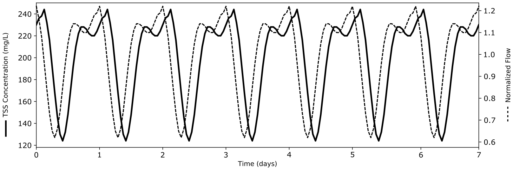
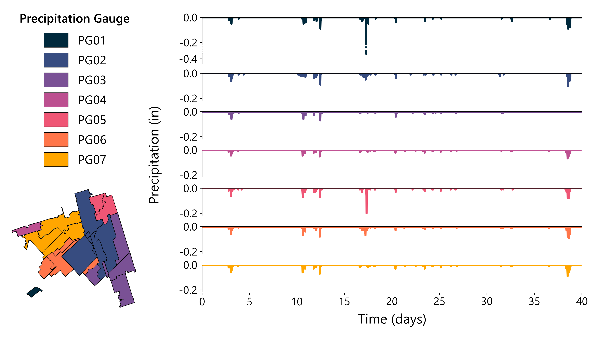

Scenario Epsilon
================

This scenario is based on a real world-inspired combined sewer network.
There are 11 in-line storage dams that lie in the sewer pipes with
varying diameters (min: 2.74 :math:`m`, max: 4.72 :math:`m`); these dams
are modeled as orifices in the hydraulic simulator. The network drains
to an outlet which is representative of a water resource recovery
facility (WRRF).

This scenario emphasizes both water quantity and quality, modeling and
routing flows and total suspended solids (TSS) throughout the network.

Because this scenario represents a combined sewer network, there are
both wastewater and stormwater flows that enter the network at each
subcatchment. The wastewater flows follow a repeating pattern:

   title

The magnitude of flow (scaled from the normalized flow shown here) is
determined by the corresponding subcatchment area and TSS has an average
concentration of 200 :math:`mg` :math:`L^{-1}`.

Stormwater inputs are determined from rainfall-runoff dynamics of the
hydraulic simulator. TSS runoff is modeled using buildup and washoff
functions. In the hydraulic node upstream of each dam, TSS settling and
resuspension is modeling using exponential functions, where settling is
a function of stored water depth and resuspension is a function of flow
(as a proxy for velocity).

The event driver for this scenario is a 40-day time series of historical
precipitation measurements. The simulation dates are restricted to the
first 15 days to limit simulation time, but this can be extended by the
user. By including an extended time range for this combined sewer
scenario, both wastewater and stormwater dynamics are modeled and users
can assess controller performance over a range of conditions.

Within the network of this scenario, there are 7 precipitation gauges
and 21 subcatchments; each of the subcatchments is linked to one of the
precipitation gauges. The below figure shows the 40-day precipitation
time series for each of the gauges.

   title

Control Objective
-----------------

The objective of this scenario is to maintain the TSS load at the outlet
of the sewer network below a threshold of 1.05 :math:`kg`
:math:`s^{-1}`, the maximum wastewater TSS load. This must be done while
avoiding flooding.

Observable States
-----------------

At each of the 11 in-line storage dams, the following states are
observable: - Outflow [:math:`m^3` :math:`s^{-1}`] - Water levels
[:math:`m`] - TSS concentrations [:math:`kg` :math:`m^{-3}`] - Valve
settings [%]

At the outlet of the sewer network (which flows to the downstream WRRF),
the following states are observable: - Outflow [:math:`m^3/s`] - TSS
concentration [:math:`kg/m^3`]

Each of these states are provided at a 10 :math:`s` sampling frequency
throughout the 40-day simulation.

Controllable assets
-------------------

All 11 in-line storage dams in network are controllable and are modeled
as orifices that can be adjusted as a percentage of valve opening [0% to
100%]. All dams are initially set to 100% open.
