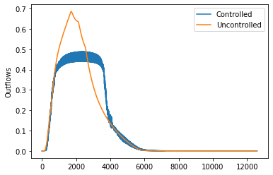

=========
Scenarios
=========

Scenarios in ``pystorms``
=========================
        
Scenarios are the primary components of the ``pystorms`` library. These scenarios are designed to be used for quantitatively evaluating the performance of stormwater control algorithms.

.. image:: ./figures/fig_scenarioComponents.png
        :width: 400
        :align: center

Each is scenario comprises of the following:
        1. An underlying stormwater network
        2. A system driver (e.g., rain event)
        3. A set of controllable assets
        4. A set of observed states
        5. A control objective

``pystorms`` includes 7 scenarios with diverse set of objectives; these are summarized in the table below.

.. csv-table:: Scenarios included in pystorms
        :file: ./tables/scenarios.csv
        :widths: 5, 10, 10
        :header-rows: 1

Please refer to manuscript for additional details on the individual scenarios. 

Jupyter Notebooks 
=================

We have included jupyter notebooks demonstrating the use of pystorms scenarios for testing control algorithms.

1. Theta: `Scenario theta <https://github.com/kLabUM/pystorms/blob/master/tutorials/Scenario_Theta.ipynb>`_
2. Alpha: `Scenario alpha <https://github.com/kLabUM/pystorms/blob/master/tutorials/Scenario_Alpha.ipynb>`_
3. Beta: `Scenario beta <https://github.com/kLabUM/pystorms/blob/master/tutorials/Scenario_Beta.ipynb>`_
4. Gamma: `Scenario gamma <https://github.com/kLabUM/pystorms/blob/master/tutorials/Scenario_Gamma.ipynb>`_
5. Delta: `Scenario delta <https://github.com/kLabUM/pystorms/blob/master/tutorials/Scenario_Delta.ipynb>`_
6. Epsilon: `Scenario epsilon <https://github.com/kLabUM/pystorms/blob/master/tutorials/Scenario_Epsilon.ipynb>`_
7. Zeta: `Scenario zeta <https://github.com/kLabUM/pystorms/blob/master/tutorials/Scenario_Zeta.ipynb>`_

The following section outlines the use of scenario theta for evaluating equal-filling degree controller. 

Example: Scenario Theta
=======================

This scenario was created to serve as a unit test for control algorithms.
In this scenario, two idealized basins (in parallel) of :math:`1000m^3` are draining into a downstream water body. 
Outlets in the basins (:math:`1m^2`) are at the bottom and can be controlled throughout the duration of the simulation.

.. image:: ./figures/theta.png
  :width: 400
  :align: center

Objective
---------

Maintain the flow of water at the outlet of the stormwater network below :math:`0.5 m^3s^{-1}`.
The degree of success or failure of the algorithm to achieve the objective is computed based on the following metric.

States
------

Water levels (:math:`m`) in the two basins at every step, indexed by the order of the basin are
defined as the states in this scenario.

Control actions
---------------

Percent of valve opening :math:`[0,1]` at the outlet of each basin.

Example: Equal-filling Controller
---------------------------------
.. code:: ipython3

    import pystorms
    import numpy as np
    import matplotlib.pyplot as plt
    %matplotlib notebook

.. code:: ipython3

    env = pystorms.scenarios.theta()
    done = False
    while not done:
        done = env.step(np.ones(2))
    print("Uncontrolled Performance : {}".format(env.performance()))

.. parsed-literal::

    Uncontrolled Performance : 0.1296391721430919

**Lets take a look at the network outflows in the uncontrolled
response**

.. code:: ipython3

    plt.plot(env.data_log["flow"]["8"])
    plt.ylabel("Outflows")

.. parsed-literal::

    Text(0, 0.5, 'Outflows')

.. image:: figures/theta_uncontrolled.png

Now, lets see if we can design a control algorithm to maintain the
flows below :math:`0.5 m^3s^{-1}`

Design of such a control algorithm can be approached in many ways. But
the fundamental idea behind any of these algorithms would be to hold
back water in the basins and coordinate the actions of these basin such
that their cumulative outflows are below the desired threshold. In this
example, we will design a simple algorithm that achieves this.

.. code:: ipython3

        def controller(depths,
                       N=2,
                       LAMBDA=0.5,
                       MAX_DEPTH=2.0):
            
            # Compute the filling degree
            f = depths/MAX_DEPTH
            
            # Estimate the average filling degree
            f_mean = np.mean(f)
            
            # Compute psi
            psi = np.zeros(N)
            for i in range(0, N):
                psi[i] = f[i] - f_mean
                if psi[i] < 0.0 - 10**(-4):
                    psi[i] = 0.0
                elif psi[i] >= 0.0 - 10**(-4) and psi[i] <= 0.0 + 10**(-4):
                    psi[i] = f_mean
            
            # Assign valve positions
            actions = np.zeros(N)
            for i in range(0, N):
                if depths[i] > 0.0:
                    k = 1.0/np.sqrt(2 * 9.81 * depths[i])
                    action = k * LAMBDA * psi[i]/np.sum(psi)
                    actions[i] = min(1.0, action)
            return actions

.. code:: ipython3

            env_controlled = pystorms.scenarios.theta()
            done = False 
            while not done:
                state = env_controlled.state()
                actions = controller(state, 0.50)
                done = env_controlled.step(actions)

.. code:: ipython3

            plt.plot(env_controlled.data_log["flow"]["8"], label="Controlled")
            plt.plot(env.data_log["flow"]["8"], label="Uncontrolled")
            plt.ylabel("Outflows")
            plt.legend()

.. code:: ipython3

            print("Controlled performance: {} \nUncontrolled performance: {}".format(env_controlled.performance(), env.performance()))

.. parsed-literal::

    Controlled performance: 0.0 
    Uncontrolled performance: 0.1296391721430919

Controller is able to maintain the outflows from the network below the desired threshold.

